# Demand Prediction in Online Advertisements
### To predict demand for an online classified ad

**Author** : SHAILESH DHAMA

To predict demand for an online advertisement based on its full description (title, description, images, etc.),its context (geographically where it was posted, similar ads already posted) and historical demand for similar ads in similar contexts. This involves both NLP (text data in Russian) and Image data along with numerical.

### Dataset : https://www.kaggle.com/c/avito-demand-prediction/data

The description of the data files from the data page:

**train.csv** - Train data.

**test.csv** - Test data. Same schema as the train data, minus deal_probability.

**train_active.csv** - Supplemental data from ads that were displayed during the same period as train.csv. Same schema as the train data, minus deal_probability.

**test_active.csv** - Supplemental data from ads that were displayed during the same period as test.csv. Same schema as the train data, minus deal_probability.

**periods_train.csv** - Supplemental data showing the dates when the ads from train_active.csv were activated and when they where displayed.

**periods_test.csv** - Supplemental data showing the dates when the ads from test_active.csv were activated and when they where displayed. Same schema as periods_train.csv, except that the item ids map to an ad in test_active.csv.

**train_jpg.zip** - Images from the ads in train.csv.

**test_jpg.zip** - Images from the ads in test.csv.

**sample_submission.csv** - A sample submission in the correct format.

## Approach:

### Data processing & Exploratory Data Analysis:

    1.Import Libraries
    2.Loading and processing data
    3.Build our Convolutional Neural Network
    4.Show important plots
    5.Test our model
           
## RESULTS :

#### Region Distribution
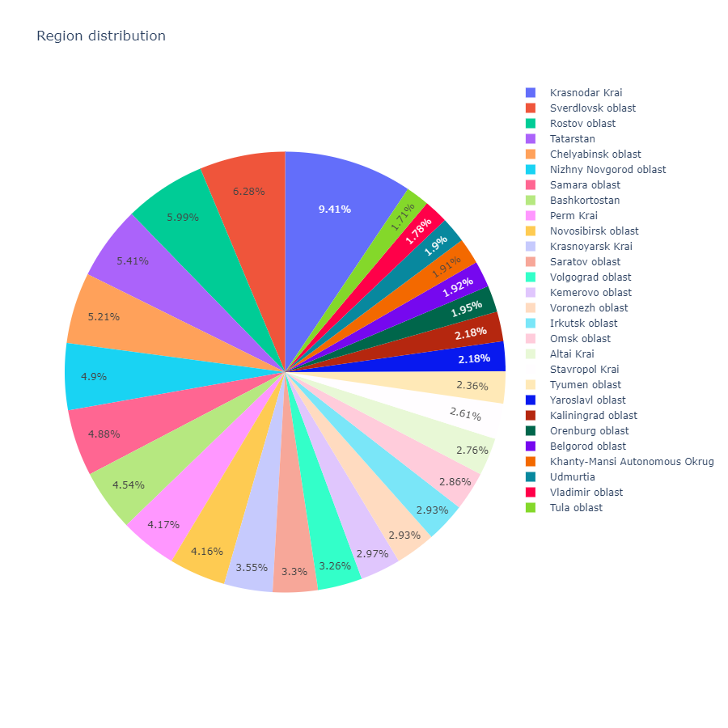

#### Deal probability by region
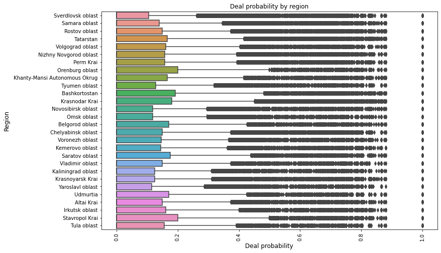

#### City wise distribution of Ads
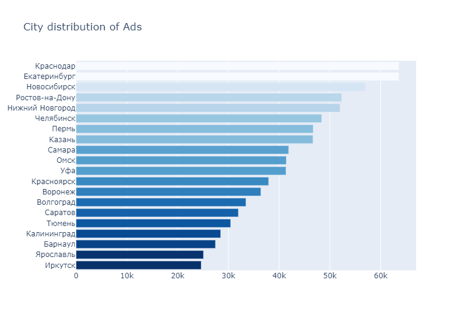

#### Parent Category distribution
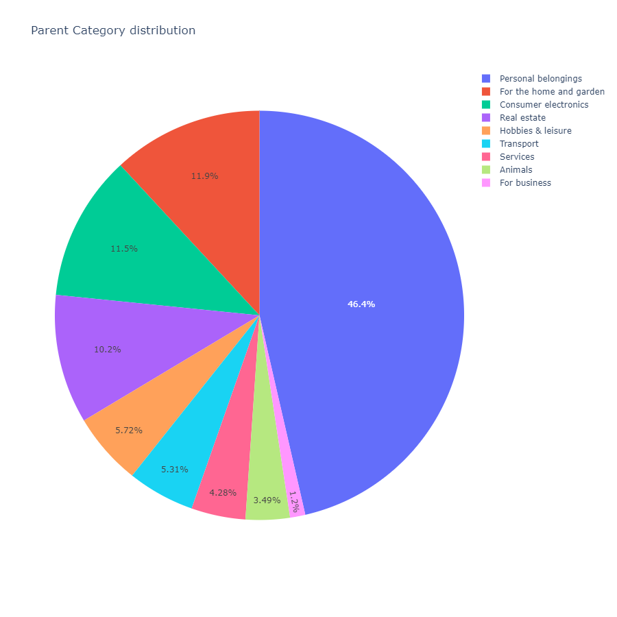

#### Deal probability by parent category
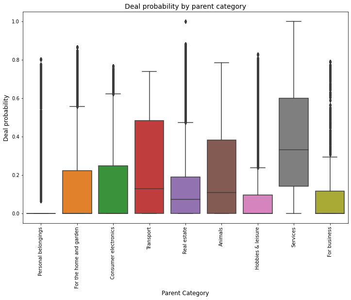

#### Category Name of Ads - Count
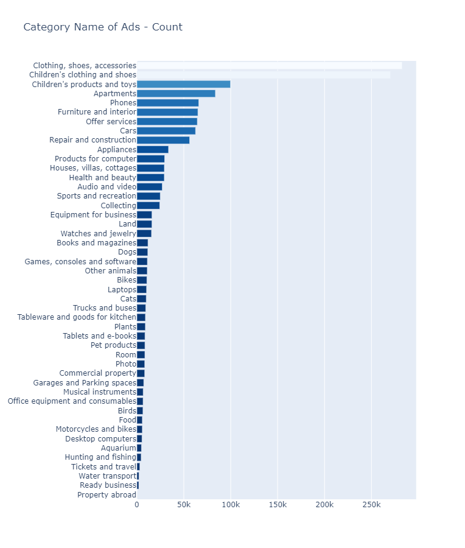

#### User Type distribution
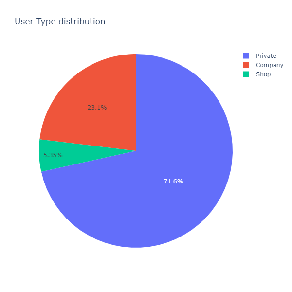

#### Log of Price Histogram
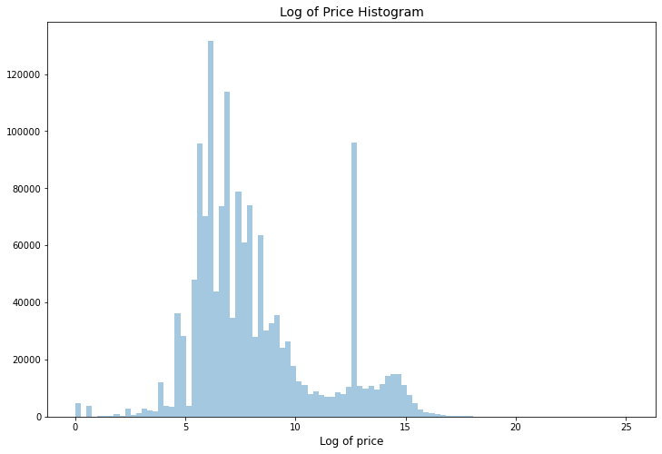

#### Activation Dates in Train
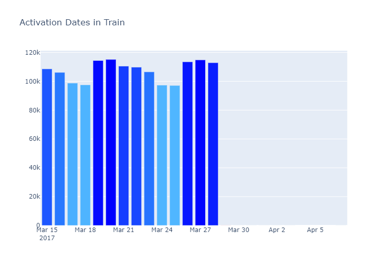

#### Activation Dates in Test
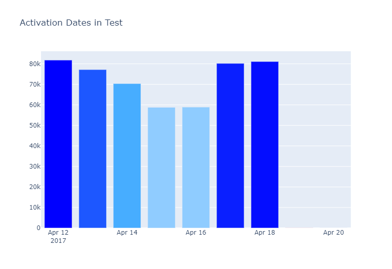

#### Number of users in train and test
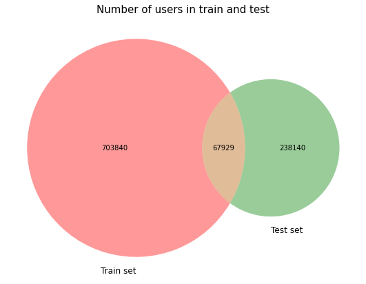

#### Number of titles in train and test
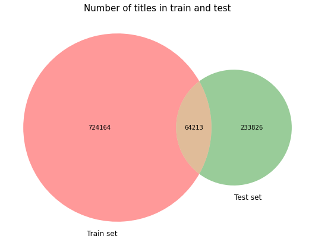

#### Number of words in title column


#### Number of words in Description column
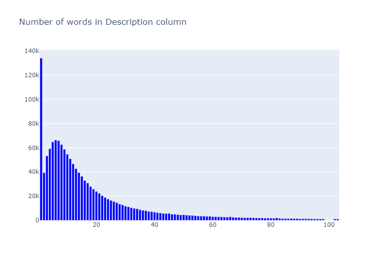

#### Distribution of Deal Probability
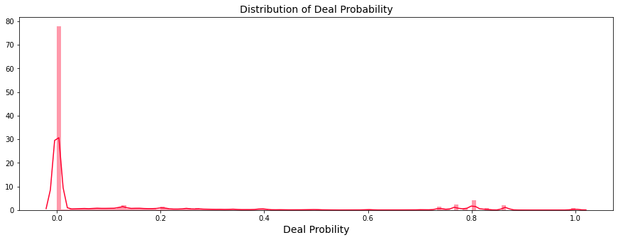

#### Demand Visualisation among Russia
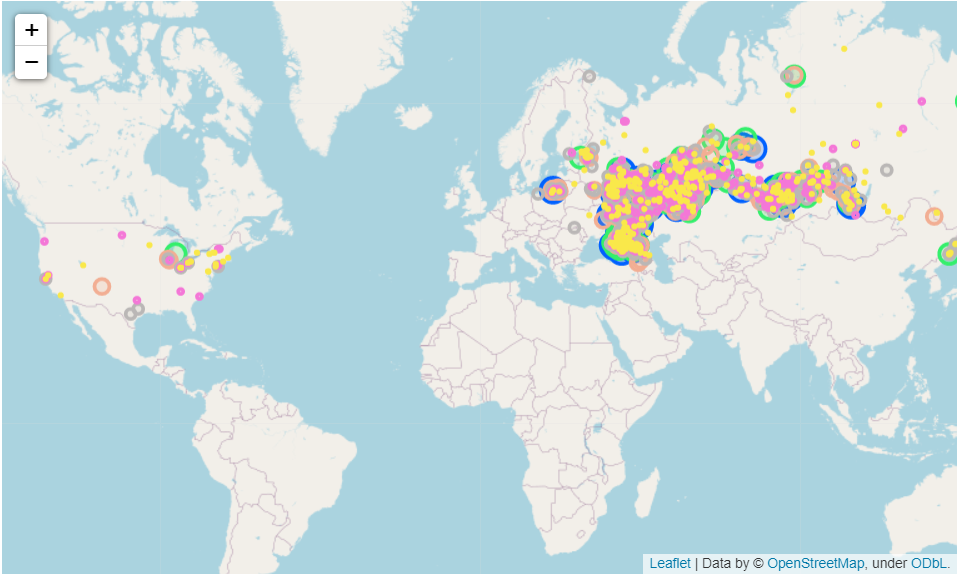

#### Good Online Advertisments 
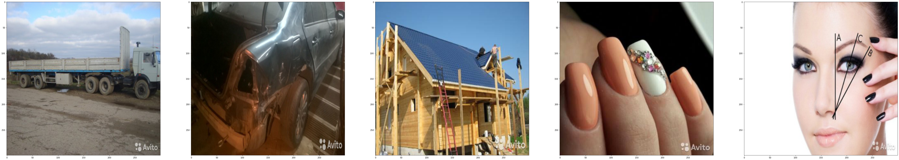

#### Bad Online Advertisments
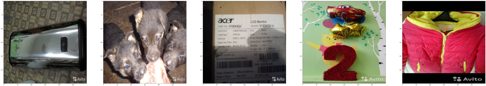
 
 #### VGG16 Model Summary
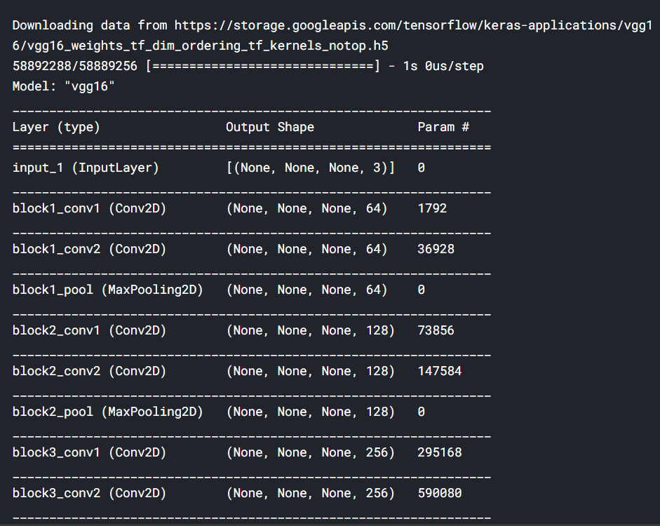
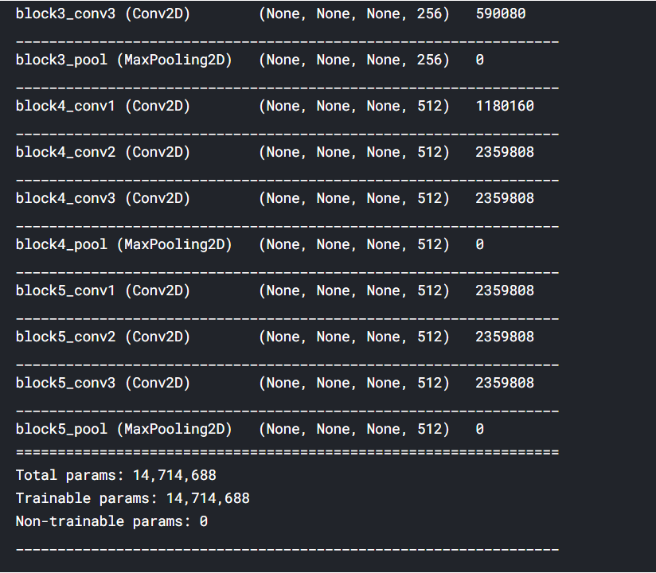

### For further information:

Please review the narrative of our analysis in [our jupyter notebook](./Demand%20Prediction%20in%20Online%20Advertisements.ipynb)

For any additional questions, please contact **shaileshettyd@gmail.com)

##### Repository Structure:

```
├── README.md                                                                                                   <- The top-level README for reviewers
├── Demand%20Prediction%20in%20Online%20Advertisements.ipynb                                                    <- Narrative documentation of analysis
├── https://www.kaggle.com/c/avito-demand-prediction/data                                                       <- Dataset
└── images                                                                                                      <- generated from code
```
## Citing :

```
@misc{Shailesh:2020,
  Author = {Shailesh Dhama},
  Title = {Demand Prediction in Online Advertisements},
  Year = {2020},
  Publisher = {GitHub},
  Journal = {GitHub repository},
  Howpublished = {\url{https://github.com/ShaileshDhama/-Demand-Prediction-in-Online-Advertisements}}
}
```
